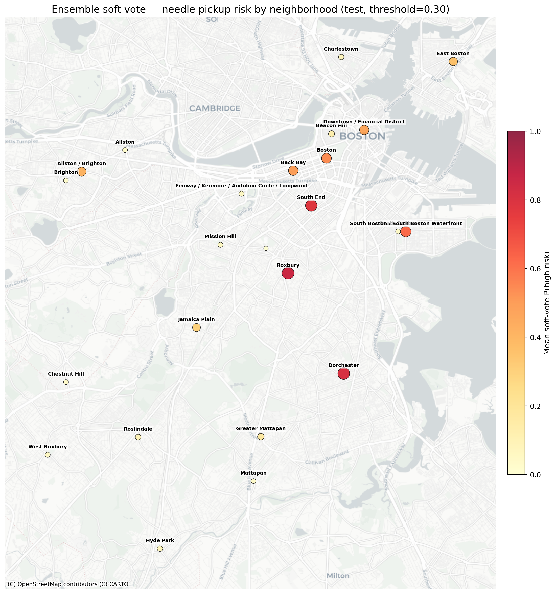

# Boston 311 Analysis

This repository analyzes [Analyze Boston](https://data.boston.gov/) 311 data, using needle pickup service requests as a lens on spatial and temporal risk. The work asks whether high-need neighborhoods or time periods can be anticipated to support proactive resource allocation.

## Notebooks

**[eda.ipynb](./eda.ipynb)** frames the project motivation and research question: treating needle-related 311 calls as a proxy for substance-related harms in the city, and aiming to predict where and when risk is elevated. It loads multi-year 311 extracts, walks through data assembly and cleaning, and supports exploratory analysis that motivates the modeling choices described in the other notebooks.

**[random_forest.ipynb](./random_forest.ipynb)** builds the supervised learning pipeline for **neighborhood–month** prediction: feature engineering from `master_311_clean.csv`, exploratory views of distributions and relationships, aggregation to monthly units, and a **Random Forest classifier** for a binary **high-risk** label (elevated needle activity relative to a policy-oriented threshold). It includes time-based train/test design and threshold tuning aligned with high recall on the training period.

**[neural_network.ipynb](./neural_network.ipynb)** extends the same cleaned 311 foundation toward **weekly spike detection** at the neighborhood level: constructing a full neighborhood–week panel (including zero-incident weeks), defining spike labels from rolling baselines, and comparing baselines with **temporal** neural models (including a temporal CNN), plus follow-on iterations on label sensitivity and probability thresholding for operational trade-offs.

**[modeling_conclusions.ipynb](./modeling_conclusions.ipynb)** runs an **apples-to-apples comparison** on the same monthly `high_risk` target and feature set exported from the Random Forest pipeline (`model_df.csv`): re-benchmarking Random Forest, **XGBoost**, and tabular deep models such as **TabNet** (and optional transformer-style variants) under an identical time split and threshold-selection protocol so differences reflect model family rather than preprocessing or evaluation quirks.

# Conclusion
Across the monthly high-risk task, gradient-boosted and forest models are strong baselines; averaging probabilities from several diverse models (soft voting) improves ranking and balanced error on the held-out 2024+ period. The map below summarizes mean predicted high-risk probability by neighborhood on that test window—useful for prioritizing outreach and cleanup when the goal is to catch true high-need months rather than minimize every false alarm.

*Figure: mean soft-vote P(high risk) by neighborhood on the 2024+ test slice; dot size and color encode the same quantity.*